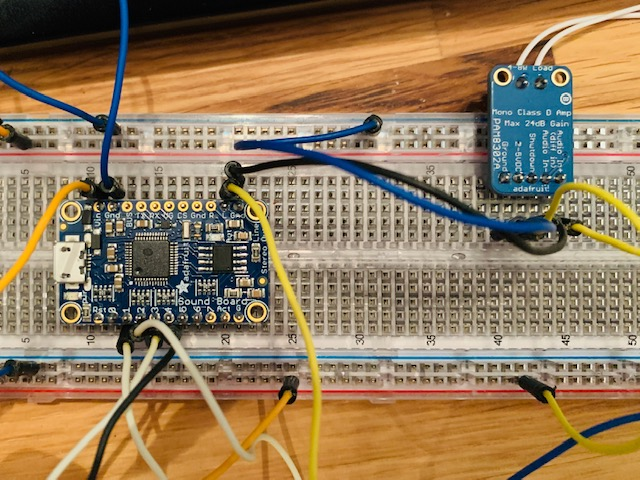
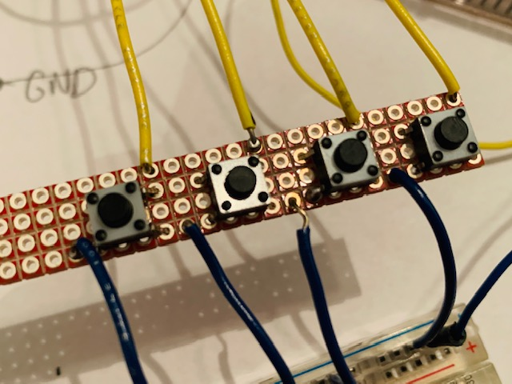

# The Best Part of Waking Up, is a Sound Board in Your Cup

A few years ago, while sitting in a conference room with colleagues, I
told a joke. When the joke was about to land, I slapped my hands in
quick succession on the table, and said <q>TSSHH.</q> It was San Francisco
office space, so the wall behind me _may_ have been brick, although
the lights weren't on me, nor was the room smoke filled. I immediately
wished for a "sound board," with a button to press to get a more
realistic version of the rimshot I had replicated.

After a little research, I realized that to do what I want, it'd cost
me a little bit of money, and not a _ton_ of time. It was still too
much commitment for me. I cast it off.

Probably a month or so later I thought about that project again, and
had an epiphany! It'd be _much_ better if the sound board was hiding
in plain site, like, say, within a coffee cup! Pretend like you're
taking a sip of coffee, and oh there it is, a wilhelm scream
<q>AAAAAAAAHHHHHHHHHH!!!!</q>

Or, land a joke? <tt>*BAH DUM TSSH*!</tt>

Or, meeting too quiet? How about some crickets!?

Joke a little bit flat? <q><big>Whomp</big>, whomp, <small>whomp</small>.</q>

It'd probably look something like [this](https://www.youtube.com/watch?v=U04ufTjn5ew). _(This is a link to a YouTube video. But, because I refuse to subject my readers to explicit tracking, I have not embedded it on the page. Copy and paste the URL to avoid sending a <tt>Referer</tt>, or use an alternative YouTube viewer -- Ed)_

---

<a href="https://oxide.computer/blog/categories/on-the-metal/" title="On the Metal: Tales from the Hardware/Software
Interface">On the Metal</a> came out late last year in support of a
new computer company. The podcast interviews people who get down and
dirty with bits, either because they're involved in _making_ bits, or
trying to waste not even one bit in providing more efficient
abstractions over physical hardware.

Needless to say, I realized how much I've neglected that side of
computing things in my life. I don't think about hardware anymore,
don't think about cache lines, firmware, and rack designs that create
the best opportunity for cooling. I haven't had to since college. And,
even then, it was one or two classes where some of the above topics
had relevance.

I'm probably _not_ going to dramatically shift my career into
hardware, or even into firmware and other super low level things. As a
hobbiest, though, it might be possible to do a few things now and
again. I seem to stumble upon this realization every couple of years,
and as a result I've got a mostly neglected, disorganized parts bin, 
and a soldering iron.

In the bin, this time, I found a [Hidiot](https://hidiot.com/), which
I bought with the intention of soldering practice.  It remains in an
electrostatic bag with the hand written note thanking me and wishing
me well.

Around that same time I purchased the Hidiot, I had ambitions to build
a video game and hook it up to my TV. I got as far as a
[Sokoban](https://github.com/apg/sokoduino) game, playable with hard
wired buttons, on an Arduino Uno, over the serial line, all on a
breadboard. My intention was to bit-bang a video signal back to a TV
and play it that way. But, of course, the TV aspect never
happened. _(Does my 4K TV even have video in? Probably, but ... I
probably need an older monitor for my well being.--Ed)_

My interest never seems to stick for some reason. Perhaps it's the
lack of community I have nearby (my fault, no one elses), or this sense
that there's not enough time--not sure. But, either way, the ambition is
often fleeting.

Did I have motivation for something, _anything_ else in hardware that
I could actually finish before losing interest? 

I had a short work trip upcoming, with days of sitting in a conference
room, maybe I should revisit the sound board coffee cup?

Seemed easy enough. Take an Adafruit sound board, solder on a small
amp, hookup a speaker, wire up some batteries, some buttons, put it in
a coffee cup, and _wake up to a sound board in the morning._

---

Parts list:

- [Adafruit Audio FX Mini Sound Board (2MB)](https://www.adafruit.com/product/2342)
- [Adafruit Mono 2.5W Class D Audio Amplifier](https://www.adafruit.com/product/2130)
- [Mini Metal Speaker w/ Wires - 8 ohm 0.5W](https://www.amazon.com/gp/product/B00N4YSRRC/ref=ppx_yo_dt_b_asin_title_o00_s02?)
- Parts bin: Generic AAA battery pack, with switch.
- Parts bin: 4 6mm tactile button switches
- Parts bin: solid core wire
- Parts bin: breadboard
- Parts bin: [Sparkfun Snappable Protoboard](https://www.sparkfun.com/products/13268)

The wiring was pretty straight forward, but this was my first time
soldering on headers to little boards. It was late, I wasn't thinking straight
and soldered the headers on the amp the wrong way, forcing some annoyances
during the prototyping stage.

<figure></figure>

<figure></figure>

The button board was fun. I realized, at some point, that the quickest way to finish this was to do was to just use a smaller breadboard. That meant I didn't need do anything fancy for the ground lines. There's more than enough connections on the bread board. _(This felt like cheating, but, you can't argue with results--Ed)_

The solid core wire used for soldering the button board turned out to be a great idea since it was able to provide _structure_ when installed within the cup. The final result looks like this, seen here without the electrical tape holding everything in place, or the speaker installed underneath the black lid.

<figure></figure>

The buttons are positioned for your thumb to engage them discreetly. Pretend you're drinking coffee, and no one is the wiser.

<figure></figure>

The four buttons, top to bottom:

- Crickets Chirping
- Wilhelm Scream
- Sad Trombone
- Rimshot

(If you missed the link to the video above, [here it is again](https://www.youtube.com/watch?v=U04ufTjn5ew))

I brought it to our meetings, and it was a hit!

The cup was the butt of every joke for the first half of the first
day, before I put it away for our out of office lunch. During the
second day, it was noticably absent, with people pointing out places
in which the coffee cup's capabilities would have been wildly
appropriate. For the afternoon session, I brought it back out,
especially as there were new folks joining us. They, too,
seemed to appreciate the extra encouragement with every zinger!

All in all, this was a fun little project that taught me a few
valuable lessons about soldering and breadboarding. I'll take
those with me to the next project, which hopefully won't be the
butt of the joke.

_- 2020/02/10_

